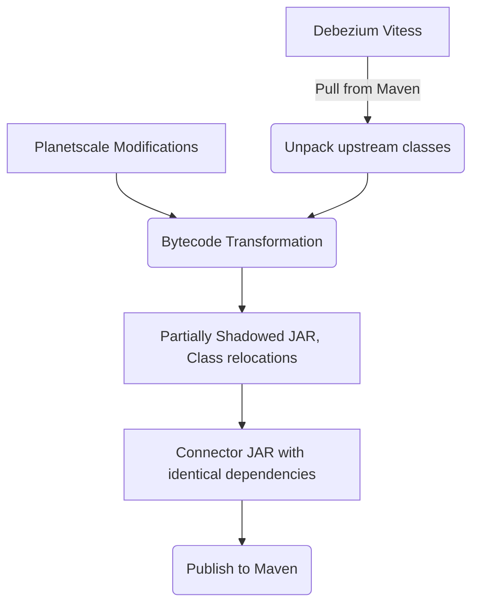
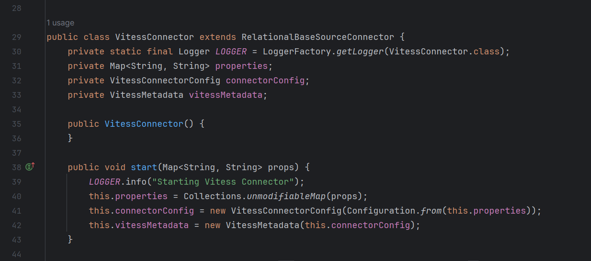
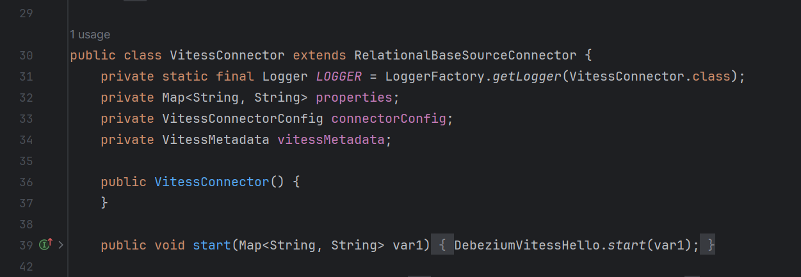
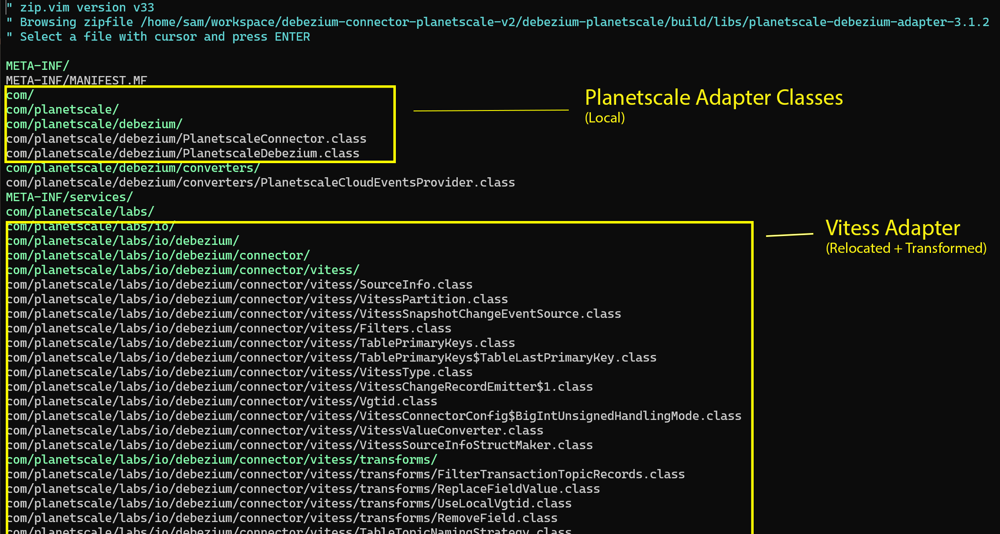
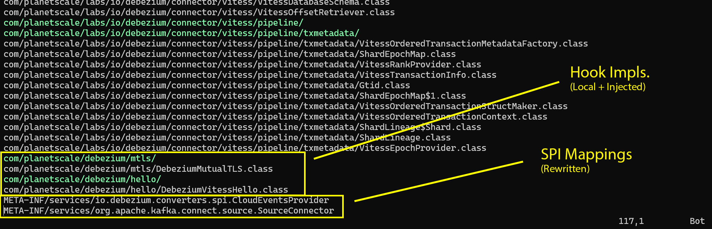

<!--
#
# Copyright (c) 2025 James S. Clark
#
# This is private source code.  You may not use, copy, or distribute this file under any circumstances without written
# permission from the copyright holder, depicted above. All rights reserved.
#
-->
# Debezium Connector for Planetscale

This repository implements a Debezium connector for Planetscale, enabling change data capture (CDC) capabilities for
applications using Planetscale as their database. Planetscale is the Vitess company and cloud database; this repo adapts
the Debezium Vitess connector for seamless integration with Planetscale.

In order to avoid upstream merge conflicts and achieve a minimal coupling surface, this repo forks the upstream connector
**in bytecode**, effectively, and only overrides necessary logic to create a Planetscale connector. Thus, upstream feature
updates and fixes can be adopted here as fast as possible and with minimal effort.

- **[Developer Docs](./dev.md)**
- **[Research Material](./research/10-claude-adapter-structure)**

## Architecture



1) The upstream Debezium Vitess connector is pulled from Maven.
2) The upstream classes are unpacked.
3) Bytecode transformations are applied from the [`transforms`](../transforms), by the [`transformer`](../transformer).
4) A partially-shadowed JAR is created, with the following attributes:
   - All transformed classes from the Vitess connector.
   - All local classes involved in implementing hooks and override logic.
   - The upstream Vitess connector classes are relocated to a subordinate package.
5) An connector JAR is created which perfectly mirrors the upstream Vitess connector's dependencies.

### Bytecode Transformations

This codebase uses [ByteBuddy](https://bytebuddy.net/) to perform transformation of both upstream and local bytecode.
Types are created (or modified) via [ByteBuddy's Gradle plugin](https://bytebuddy.net/#gradle-plugin).

Here is a simple example transformation:

**`VitessHello.kt`**
```kotlin
// Implements a BuildBuddy build-time transformation which intercepts a method.
class VitessHello : AbstractTransform() {
  // We are interested in transforming the `VitessConnector` class.
  override fun matches(target: TypeDescription): Boolean = target.simpleName == "VitessConnector"

  override fun transform(builder: Builder<*>): Builder<*> = builder
    // intercept the method `start`
    .method(ElementMatchers.named("start"))
    // delegate it to `DebeziumVitessHello.start`
    .intercept(MethodDelegation.to(DebeziumVitessHello::class.java))
}
```

**`DebeziumVitessHello.kt`**
```kotlin
// Must be an `object` so that all methods are static.
object DebeziumVitessHello {
  // Must have matching signature to the intercepted method. BuildBuddy will check at build time.
  @JvmStatic fun start(props: java.util.Map<String, String>?) {
    println("Hello intercepted method!")
  }
}
```

Before transformations are applied, decompiling the `VitessConnector` class in IDEA yields:



> Find this class at the path after building the codebase:<br />
> `debezium-planetscale/build/debezium/classes/io/debezium/connector/vitess/VitessConnector.class`

After transformations are applied, decompiling the `VitessConnector` class in IDEA shows the injected call:



> Find this class at the path after building the codebase:<br />
> `debezium-planetscale/build/classes/kotlin-transformed/main/io/debezium/connector/vitess/VitessConnector.class`

### Partially-Shadowed JAR

To facilitate running the connector, a partially-shadowed JAR is created, which, in substance, replaces the upstream
Vitess connector JAR for users. This JAR is assembled in a manner which is careful to avoid runtime class loading
conflicts, even with the upstream Vitess connector which is wrapped to create the Planetscale connector.

**The shadowed JAR contains:**

- All transformed classes from the Vitess connector, relocated to a subordinate package.
- All local classes involved in implementing hooks and override logic.

No other dependencies are included in the shadowed JAR, as it is still intended to be used in conjunction with a
classpath assembled from the same dependencies as the upstream Vitess connector.




> [!NOTE]
> Services are rewritten to account for relocations, and for the injected Planetscale connector facade. See below
> for details.

### SPI and Relocations

The following services are supported by the final Planetscale connector JAR:

**`META-INF/services/org.apache.kafka.connect.source.SourceConnector`**
```
com.planetscale.debezium.PlanetscaleConnector
```

**`META-INF/services/io.debezium.converters.spi.CloudEventsProvider`**
```
com.planetscale.debezium.converters.PlanetscaleCloudEventsProvider
```

In effect, this means that only the Planetscale connector will show up as a registered Kafka Connect source. For users to
use the original Vitess connector, they must explicitly install the upstream Vitess connector JAR, as normal.

### Publishing

After assembling the partially-shadowed JAR, a POM is assembled which matches the upstream Vitess connector's requisite
dependencies. Thus, end-users can use the Planetscale connector as a drop-in replacement for the upstream Vitess connector,
with the same dependencies, and no class conflicts.

The final published JAR can be signed, published to Sigstore, and published with full SBOM/SLSA metadata without
violation, so long as signatures are properly discarded from upstream JARs constituent to the shadowed connector JAR.

To facilitate easy publishing, a local Maven repository is used within the project build-root, located at:
```
debezium-planetscale/build/m2
```

Listing the contents of this directory after running `./gradlew build test check` shows a valid m2 root:
```
➜  tree -L 6 debezium-planetscale/build/m2
debezium-planetscale/build/m2
└── com
    └── planetscale
        └── labs
            └── debezium-planetscale
                ├── 3.1.2.Final
                │   ├── debezium-planetscale-3.1.2.Final.jar
                │   ├── debezium-planetscale-3.1.2.Final.jar.md5
                │   ├── debezium-planetscale-3.1.2.Final.jar.sha1
                │   ├── debezium-planetscale-3.1.2.Final.jar.sha256
                │   ├── debezium-planetscale-3.1.2.Final.jar.sha512
                │   ├── debezium-planetscale-3.1.2.Final.module
                │   ├── debezium-planetscale-3.1.2.Final.module.md5
                │   ├── debezium-planetscale-3.1.2.Final.module.sha1
                │   ├── debezium-planetscale-3.1.2.Final.module.sha256
                │   ├── debezium-planetscale-3.1.2.Final.module.sha512
                │   ├── debezium-planetscale-3.1.2.Final.pom
                │   ├── debezium-planetscale-3.1.2.Final.pom.md5
                │   ├── debezium-planetscale-3.1.2.Final.pom.sha1
                │   ├── debezium-planetscale-3.1.2.Final.pom.sha256
                │   └── debezium-planetscale-3.1.2.Final.pom.sha512
                ├── maven-metadata.xml
                ├── maven-metadata.xml.md5
                ├── maven-metadata.xml.sha1
                ├── maven-metadata.xml.sha256
                └── maven-metadata.xml.sha512

6 directories, 20 files
```

See the [developer docs](./dev.md) for publishing instructions.
