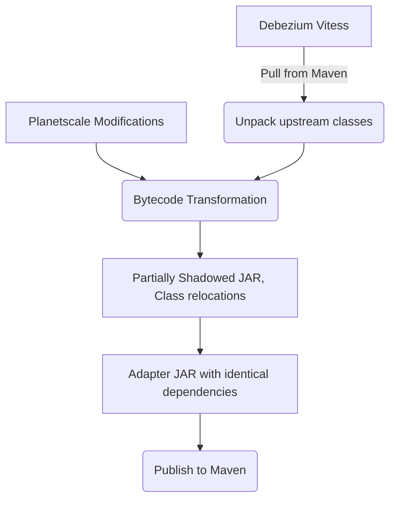

<!--
#
# Copyright (c) 2025 James S. Clark
#
# This is private source code.  You may not use, copy, or distribute this file under any circumstances without written
# permission from the copyright holder, depicted above. All rights reserved.
#
-->
# Debezium Adapter for Planetscale

This repository implements a Debezium adapter for Planetscale, enabling change data capture (CDC) capabilities for
applications using Planetscale as their database. Planetscale is the Vitess company and cloud database; this repo adapts
the Debezium Vitess adapter for seamless integration with Planetscale.

In order to avoid upstream merge conflicts and achieve a minimal coupling surface, this repo forks the upstream adapter
**in bytecode**, effectively, and only overrides necessary logic to create a Planetscale adapter. Thus, upstream feature
updates and fixes can be adopted here as fast as possible and with minimal effort.

## Architecture



1) The upstream Debezium Vitess adapter is pulled from Maven.
2) The upstream classes are unpacked.
3) Bytecode transformations are applied from the [`transforms`](../transforms), by the [`transformer`](../transformer).
4) A partially-shadowed JAR is created, with the following attributes:
   - All transformed classes from the Vitess adapter.
   - All local classes involved in implementing hooks and override logic.
   - The upstream Vitess adapter classes are relocated to a subordinate package.
5) An adapter JAR is created which perfectly mirrors the upstream Vitess adapter's dependencies.

### Bytecode Transformations

This codebase uses [ByteBuddy](https://bytebuddy.net/) to perform transformation of both upstream and local bytecode.
Types are created (or modified) via [ByteBuddy's Gradle plugin](https://bytebuddy.net/#gradle-plugin).

Here is a simple example transformation:

**`VitessHello.kt`**
```kotlin
// Implements a BuildBuddy build-time transformation which intercepts a method.
class VitessHello : AbstractTransform() {
  override fun matches(target: TypeDescription): Boolean = target.simpleName == VitessConnector::class.java.simpleName

  override fun apply(
    builder: DynamicType.Builder<*>,
    typeDescription: TypeDescription,
    classFileLocator: ClassFileLocator
  ): DynamicType.Builder<*> = builder
    // intercept the method `start`
    .method(ElementMatchers.named("start"))
    // delegate it to `DebeziumVitessHello.start`
    .intercept(MethodDelegation.to(DebeziumVitessHello::class.java))
    // make the class, so it is persisted and checked at build time
    .also { it.make() }
}
```

**`DebeziumVitessHello.kt`**
```kotlin
object DebeziumVitessHello {
  @JvmStatic fun start(props: java.util.Map<String, String>?) {
    println("Hello intercepted method!")
  }
}
```

Before transformations are applied, decompiling the `VitessConnector` class in IDEA yields:


> Find this class at the path after building the codebase:<br />
> `debezium-planetscale/build/debezium/classes/io/debezium/connector/vitess/VitessConnector.class`

After transformations are applied, decompiling the `VitessConnector` class in IDEA shows the injected call:


> Find this class at the path after building the codebase:<br />
> `debezium-planetscale/build/classes/kotlin-transformed/main/io/debezium/connector/vitess/VitessConnector.class`

### Partially-Shadowed JAR

To facilitate running the adapter, a partially-shadowed JAR is created, which, in substance, replaces the upstream
Vitess adapter JAR for users. This JAR is assembled in a manner which is careful to avoid runtime class loading
conflicts, even with the upstream Vitess adapter which is wrapped to create the Planetscale adapter.

**The shadowed JAR contains:**

- All transformed classes from the Vitess adapter, relocated to a subordinate package.
- All local classes involved in implementing hooks and override logic.

No other dependencies are included in the shadowed JAR, as it is still intended to be used in conjunction with a
classpath assembled from the same dependencies as the upstream Vitess adapter.


> [!NOTE] Services are rewritten to account for relocations, and for the injected Planetscale adapter facade. See below
> for details.

### SPI and Relocations

The following services are supported by the final Planetscale adapter JAR:

**`META-INF/services/org.apache.kafka.connect.source.SourceConnector`**
```
com.planetscale.debezium.PlanetscaleConnector
```

**`META-INF/services/io.debezium.converters.spi.CloudEventsProvider`**
```
com.planetscale.debezium.converters.PlanetscaleCloudEventsProvider
```

In effect, this means that only the Planetscale adapter will show up as a registered Kafka Connect source. For users to
use the original Vitess adapter, they must explicitly install the upstream Vitess adapter JAR, as normal.

### Publishing

After assembling the partially-shadowed JAR, a POM is assembled which matches the upstream Vitess adapter's requisite
dependencies. Thus, end-users can use the Planetscale adapter as a drop-in replacement for the upstream Vitess adapter,
with the same dependencies, and no class conflicts.

The final published JAR can be signed, published to Sigstore, and published with full SBOM/SLSA metadata without
violation, so long as signatures are properly discarded from upstream JARs constituent to the shadowed adapter JAR.
